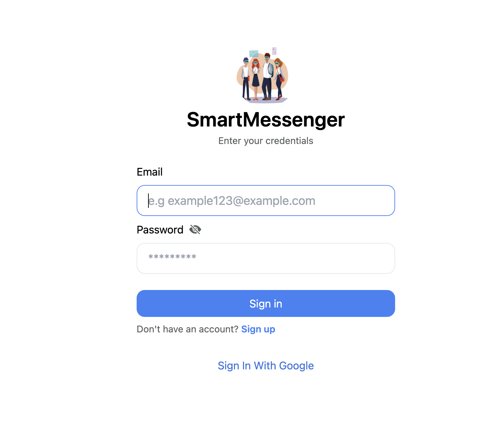
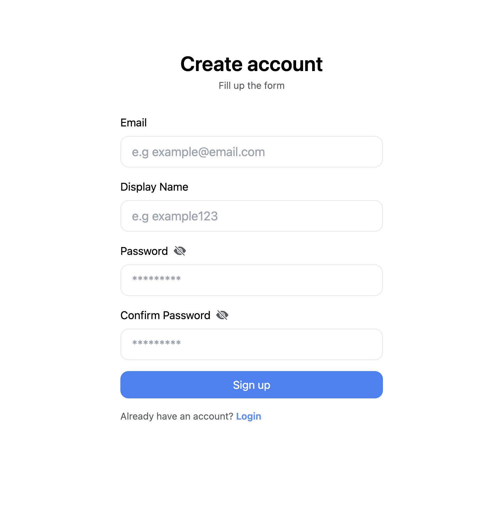
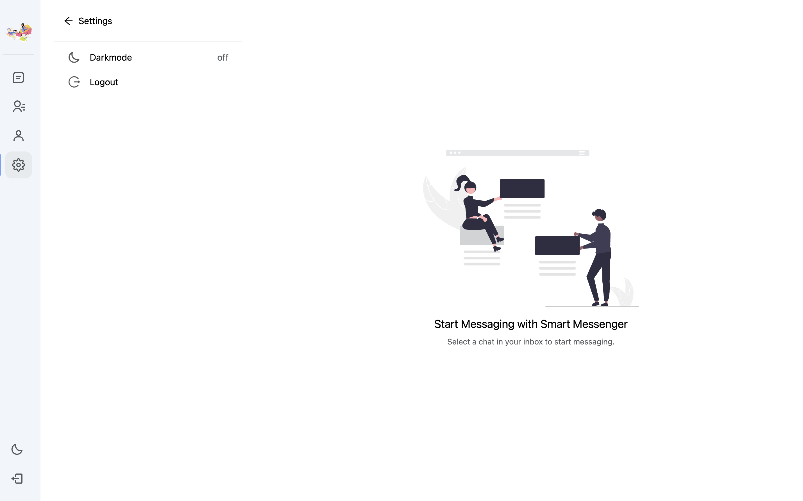

# Smart Messenger

## A Full Stack Chat Application using React and Firebase

### App Preview





### SMART MESSENGER

<video width="600" controls>
  <source src="./public/assets/review.mov" type="video/mp4">
  Your browser does not support the video tag.
</video>
### Features

- Group Chats
- Google Sign In
- Sending Images
- Profile Editing
- View Other Users' Profiles
- Show Unread Messages Count
- Edit / Delete Messages
- Light / Dark mode toggler

### Upcoming Features

- Voice Messaging
- Video Calling
- Message Reactions
- Message Threads
- Message Search
- Push Notifications
- File Sharing (documents, videos, etc.)
- Location Sharing
- Integration with Other Services (calendar, task management)
- Message Translation
- Customizable Themes (beyond light/dark mode)
- Analytics and Insights
- Read Receipts
- Mentions and Notifications (@mentions)
- Moderation Tools

### Setup Firebase Project

1. **Create Firebase Project**
2. **Enable Authentication (Email and Google Auth)**
3. **Enable Firestore DB and Storage**

4. **Create Collections**
   - users
   - userChats
   - chats
   - globalChats

### Installation Process

**Step 1: Clone Repository and Install Packages**

```bash
git clone https://github.com/johnyREX/Webstack-Portfolio-Project && cd Webstack-Portfolio-Project && npm install

Step 2: Create firebaseConfig.ts file inside src/setup/firebase directory.

// firebaseConfig.ts
export const firebaseConfig = {
  apiKey: "",
  authDomain: "",
  projectId: "",
  storageBucket: "",
  messagingSenderId: "",
  appId: "",
  measurementId: "",
};

Step 3: Start the development server.

npm start


Support
You can support this project by leaving a star. Thank you! 😁

Authors

```
